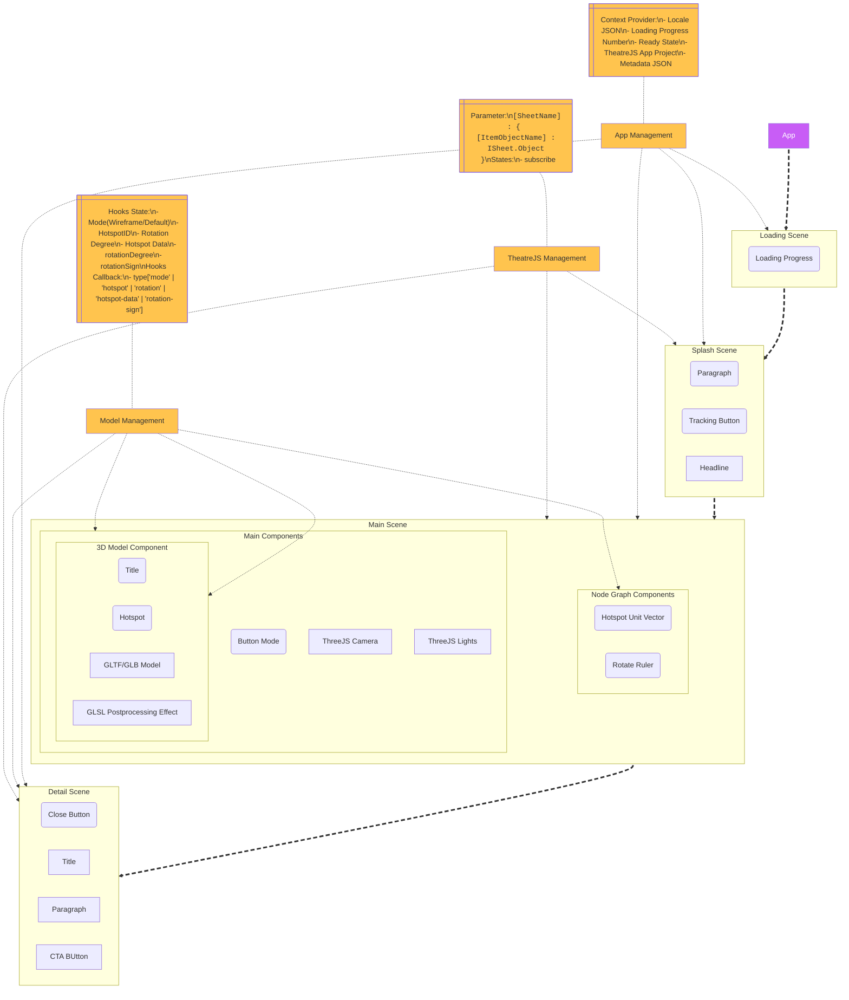

# 3D Hotspots


# Project Architecture



## Getting Started

```bash
# Clone this library
git clone https://gitlab.com/dsvideoteam/3d/3d-hotspots.git
```

### Features Uses

- GSAP (Animation)
- glsl-pipeline (WebGL)
- Lygia (GLSL Library)
- Storybook (Styling & Documentation Platform)

### Idea

The idea was to make interactive asset to work in Dassault Systemes website that uses ThreeJS library that acts as 3D Model Viewer with hotspots that guides user through information.

## Limitations

- Performance might be affected on lower spec devices. (Can be further optimized)
- Non-responsive ThreeJS camera (Make sure you setup camera distance that works across desktop & mobile ratio)
