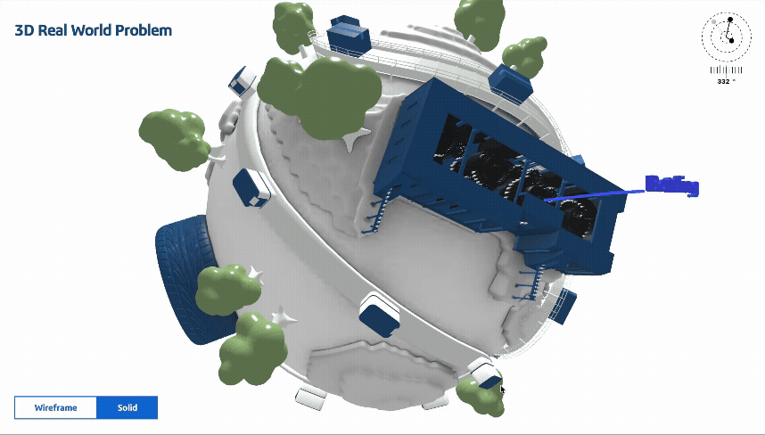
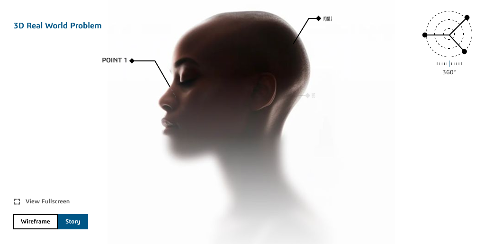
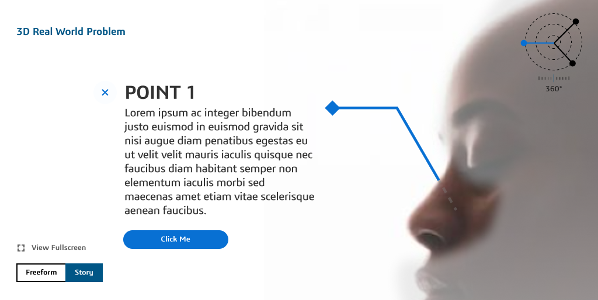

# 3D Hotspots



## Requirements

### For Windows user

- [Install & use WSL](https://learn.microsoft.com/en-us/windows/wsl/install)
- Node 18 & above ([Download Node](https://nodejs.org/en/download))
- Python 3.0 & above ([Download Python](https://www.python.org/downloads/))
- Yarn ([Download Yarn](https://yarnpkg.com/getting-started/install))

### For Mac & Linux user

- Node 18 & above ([Download Node](https://nodejs.org/en/download))
- Python 3.0 & above ([Download Python](https://www.python.org/downloads/))
- Yarn ([Download Yarn](https://yarnpkg.com/getting-started/install))

## Getting Started

```bash
# Clone this library
git clone https://gitlab.com/dsvideoteam/3d/3d-hotspots.git
```

Then refer to the link on this repo page or click [Storybook Page](https://ammein.github.io/3d-hotspots/) to learn more about the project.

### Features Uses

- GSAP (Animation)
- react-three/fiber
- react-postprocessing
- glsl-pipeline (WebGL)
- Lygia (GLSL Library)
- Storybook (Styling & Documentation Platform)

## Project Designs

1. Loading Screen


2. Splash Screen


3. Main Screen



4. Detail Screen



### Idea

The idea was to make interactive asset to work in Dassault Systemes website that uses ThreeJS library that acts as 3D Model Viewer with hotspots that guides user through information.

## Limitations

- Performance might be affected on lower spec devices. (Can be further optimized)
- Non-responsive ThreeJS camera (Make sure you setup camera distance that works across desktop & mobile ratio)
